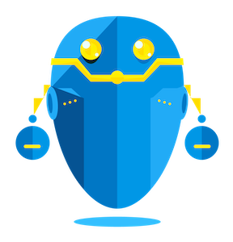

[](https://circleci.com/gh/intuit/octoductor/?branch=master)
[](https://codecov.io/gh/intuit/octoductor)


# Octoductor



## Summary

In an effort to systematically measure and gauge engineering readiness, we have identified a path to draw a clear baseline indicating that our products are reliable, consistent, and dependable. That path represents a core guardrail for engineering practices, providing crucial understanding of what it means to be production ready. The core component is the capability to orchestrate workflows for requirement checks. We have implemented a framework to automate capturing and tracking these requirements. To minimize disruption, we put the developer at the center of our solution and integrate directly into their main tool, GitHub, which is this the bread and butter of the developer’s day-to-day workflow.

We leverage GitHub’s built-in support for creating applications, which can react to any update on onboarded repositories as well as issue checks, which provide a feedback loop right on the developer’s pull request. Usually, for every quality check a user would have to onboard to a new GitHub application. Contrary, we have implemented an orchestrated workflow, which allows for a single onboarding process, but at the same time allows for adding unlimited checks in the backend as we implement them.

The benefit we see is enabling contributors to leverage the orchestration layer as well as our all native AWS serverless deployment, which can be deployed within minutes to any AWS account they own.


## What is Octoductor?

Octoductor is an application to standardize and consolidate engineering excellence checks across an organization. 

## Why Octoductor?
+ Organizations can be quite complex and, albeit critical, engineering excellence standards vary
+ Octoductor consolidates engineering excellence checks while providing a single view and summary score for each GitHub repository across an organization
+ Engineering excellence checks are fully customizable
+ Easy deployment in AWS via [Cloud Development Kit](https://docs.aws.amazon.com/cdk/latest/guide/cli.html)

## Current State
Currently, Octoductor is fully operational and can be deployed in any AWS account following standard [CDK deployment](https://docs.aws.amazon.com/cdk/latest/guide/cli.html).
Please refer to the `Deploying Octoductor` section below for more detail. There are some pre-steps required to deploy Octoductor, which entail setting up a TLS certificate,
an AWS Route 53 Hosted Zone / Domain, a Slack application, and storing your secrets in AWS Secret Manager. If you are set up correctly, you will have all the required input parameters required to deploy the CDK Stack.
These steps are currently quite manual and will be simplified / automated where possible in the future.

## Future Work
In the near future, there are several improvements that will be made:
- Reduce number of input parameters to the CDK Stack (e.g. make Slack application optional, etc.)
- Automate CDK Stack pre-requisites where possible (e.g. automatically provision hosted zone / domain, etc.)
- Improve automation of CDK Stack deployment, which now needs to happen manually from local
- Improve information passed via evaluation flow to align more closely to GitHub application API

If more items come to mind, feel free to make suggestions and open GitHub issues.

# Project Structure
The infrastucture is setu p via AWS CDK using the TypeScript language.
Application logic is usually encapsulated in an AWS Lamdba with each module being an AWS CDK project in itself. The rationale is that they can be tested and deployed in isolation. 
All the infrastructure needed to support the overall application should be exposed via a `Construct` in the `lib` directory, whereas everything needed to support the logic / functionality and testing of the application belongs into the `octoductor` folder.

Generic `Constructs` will be bundled in the [lib](octoductor/lib) module, all components are wired together in the [lib/deployment](octoductor/lib/deployment) module.

Detailed Structure:
- `bin`: where CDK app is created. Likely no changes here will ever be needed
- `lib`: where CDK Constructs are added to support infrastructure needs of Octoductor
  - `constructs`: where generic and reusable Constructs are stored
  - `deployment`: main CDO Stack deployed as part of the CDK app in the `bin` folder
  - `evaluation`: where CDK Constructs to support evaluation workflow and crawlers are stored
  - `model`: common interfaces
  - `onboarding`:  where CDK Constructs to support the Octoductor onboarding flow are stored
  - `utils`: common utilities shared across Constructs
- `octoductor`: where the entire functionality / application logic resides.
  - `common`: functionality tied to common layer shared across the entire application
  - `github`: github application logic
  - `onboarding`: functionality tied to onboarding flow
  - `scoring`: functionality tied to evaluation flow and crawlers (**Note: this is where the majority of contribution should happen**)
  - `slack`: functionality tied to Slack application. Ability to send and receive Slack messages
  - `tests`: test logic across application modules
  - `ui`: functionality tied to the dasboard to display Octoductor score by client git repo
- `test`: this is where tests reside

### Dashboard
[webapp](octoductor/README.md) \ Information about Octoductor-Dashboard


[AWS CDK Reference](https://docs.aws.amazon.com/cdk/api/latest/docs/aws-construct-library.html)

The `cdk.json` file tells the CDK Toolkit how to execute your app.

# Getting Started

## Dev Machine Setup
Requirements: Have `brew` and `docker` pre-installed

1. Install Node
`brew install node`

2. Install development tools
```bash
npm install -g yo
npm install -g yarn
npm install -g cdk

# AWS CLI Tools
brew install awscli
brew tap aws/tap
brew install aws-sam-cli
```

3. Install and link dependencies
```
yarn install
yarn link
```

4. Please ensure Python 3.7 is installed on your machine

## Contribution Protocol
Please refer to our open contribution [protocols](octoductor/CONTRIBUTING.md). 
Please refer to [sample-one](octoductor/octoductor/scoring/sample-one) and [sample-two](octoductor/octoductor/scoring/sample-two) as 
reference implementations of Octoductor's engineering excellence requirement checks. Please ensure your Python code is compatible with Python version 3.7.

## Test Your Code
- Run `mkdir cdk.out` followed by `npx cdk synth --profile foo > cdk.out/template.yaml` to automatically consolidate infra into `template.yaml` CloudFormation template.

To test Lambda functions locally:
- After running step above, `cd` to `cdk.out` folder where `template.yaml` resides and run `sam local invoke <lambda function name from template.yaml> --no-event`

## Deploying Octoductor
Pre-steps:
1. Setup a certificate for your domain in AWS Certificate Manager
2. Setup an AWS Route 53 hosted zone
3. Setup your Slack application / server
4. Store your secrets in AWS Secret Manager (Github secrets and Slack secrets)

Inside the octoductor root folder:
1. run `make clean`
2. run `yarn unlink`
3. run `yarn install`
4. run `make` to build the necessary modules and synthetize the cdk stack. This will output artifacts and an AWS Cloud Formation template. 

Finally, to deploy to your AWS account:
1. obtain valid aws credentials in your `~/.aws/credentials` file
2. run `cdk bootstrap --profile <enter your A profile name>`
3. run `cdk deploy --profile <> OctoductorStack` and provide the following parameters via the `--parameters <parameterKey>=<parameterValue>` option

```text
- EnvironmentName: environment name - supported values [dev, stg, prd]
- VpcID: The identifier of the VPC within your AWS account
- VpcCidrBlock: AWS VPC's CIDR range
- PrivateSubnetIds: List of private subnet IDs. Must be undefined or match the availability zones in length and order
- PrivateSubnetRouteTableIds: List of IDs of routing tables for the private subnets. Must be undefined or have a name for every private subnet group
- HostedZoneId: your pre-set AWS Route 53 hosted zone ID
- DomainName: your pre-set domain name from AWS Route 53
- AcmCertificateArn: your pre-set acm certificate ARN from AWS Certificate Manager
- GithubSecretArn: AWS Secret Manager ARN for the GitHub application secrets (expecting 'secret' and Base64Encoded 'key')
- SlackSecretArn: AWS Secret Manager ARN for the Slack application secrets (expecting 'slackToken')
- SlackSigningSecretArn: AWS Secret Manager ARN for the Slack signing secret - ingress traffic (expecting 'secret')
- GithubDomain: your GitHub domain (eg `https://github-dev.foobar.com/api/v3`)
- GithubApplicationId: your Github application ID
```


For more details on the last deployment steps, please refer to the standard [cdk guide](https://docs.aws.amazon.com/cdk/latest/guide/cli.html).

# Appendix
## More Useful commands
Generic commands:
- `npm run build` compile typescript to js
- `npm run watch` watch for changes and compile
- `npm run test` perform the jest unit tests
- `cdk synth` emits the synthesized CloudFormation template
- `cdk docs`	Access the online documentation
- `cdk init`	Start a new CDK project (app or library)
- `cdk list`	List stacks in an application
If you'd like to deploy to your learning account and tinkle around with the stack:
- `cdk deploy` deploy this stack to your default AWS account/region
- `cdk diff` compare deployed stack with current state
- `cdk destroy`	Deletes a stack from an AWS account
- `cdk bootstrap`	Deploy a toolkit stack to support deploying large stacks & artifacts
- `cdk doctor`	Inspect the environment and produce information useful for troubleshooting

# FAQ
- What languages are supported for the Lamdbas? The infrastructure is defined via TypeScript, but within the `function` folder you can write in any language supported by AWS Lamdba.
- How does packaging of assets work? We use the CDK's `NodejsFunction` and `PythonFunction` respectively. They leverage Docker with AWS native Lambda containers to pull in dependencies and package them in assets. Hence, only a few lines of code are needed to describe the infrastructure. E.g.,
```
export class MyConstruct extends Construct {
  constructor(scope: Construct, id: string) {
    super(scope, id);
    new PythonFunction(this, 'MyLambda', {
      entry:  join(__dirname, '../function'),
    });
  }
}
```
- Also see https://aws.amazon.com/lambda/faqs/
- [AWS CDK Toolkit (cdk command)](https://docs.aws.amazon.com/cdk/latest/guide/cli.html)
- [AWS Toolkit for Visual Studio Code](https://docs.aws.amazon.com/cdk/latest/guide/vscode.html)
- [SAM CLI](https://docs.aws.amazon.com/cdk/latest/guide/sam.htmlhttps://docs.aws.amazon.com/cdk/latest/guide/sam.html)
- [Writing Tests](https://docs.aws.amazon.com/cdk/latest/guide/testing.html)
- [RFCs for the AWS CDK](https://github.com/aws/aws-cdk-rfcs)
- Some CDK Samples
    - [AWS CDK Examples](https://github.com/aws-samples/aws-cdk-examples)
    - [Awesome CDK](https://github.com/kolomied/awesome-cdk)
    - [@cloudcomponents/cdk-constructs](https://github.com/cloudcomponents/cdk-constructs)
- Lamdba Constructs / Asset Bundling
    - [lambda.PythonFunction](https://docs.aws.amazon.com/cdk/api/latest/docs/aws-lambda-python-readme.html)
    - [lambda.NodejsFunction](https://docs.aws.amazon.com/cdk/api/latest/docs/aws-lambda-nodejs-readme.html)
    - [HowTo GO](https://aripalo.com/blog/2020/building-lambda-functions-inside-docker-containers-with-cdk/)
- [S3 Assets](https://docs.aws.amazon.com/cdk/api/latest/docs/aws-s3-assets-readme.html)
